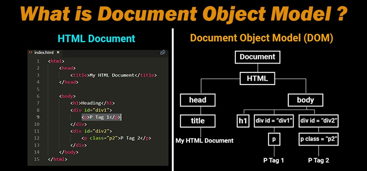

What is HTML and CSS?

HTML is short for HyperText Markup Language. It's a standard markup language for creating Web pages.HTML is a language we'll use to describe the structure of a web page. It's consisted of serious of elements: all of the buttons and the text and the forms and other parts of the web page
that the user ultimately sees and interacts with.

CSS stands for Cascading Style Sheets. CSS is the language we use to style an HTML document. CSS is the language we'll use to describe the style of a web page, the colors and the fonts and the layouts and the spacing that make the web page look exactly the way we want it to look.

These two languages that are central to the understanding of web pages.

text-based code that we write that a web browser, like Safari
or Chrome or Firefox, is then able to look at, parse, understand,
and display to the user.

Let examine the anatomy of an HTML element:

```
<!DOCTYPE html>
<html lang="en">
  <head>
    <meta charset="UTF-8" />
    <title>First HML file ever!</title>
  </head>
  <body>
    Hello, world!
  </body>
</html>
```

The first line of this document `<!DOCTYPE html>`is called a doctype declaration. It's not actually an HTML element, but it's a special line that tells the browser what kind of document this is. In this case, it's an HTML document version 5. Depending on the version of HTML, the web browser might
want to display different information or it might need to parse the page a little bit differently.

The next line is the opening HTML tag `<html lang="en">`. This is the first HTML element in the document. It's called the root element, and it contains all of the other elements in the document.
The lang attribute `lang="en"` is a special attribute that tells the browser what language the document is written in. In this case, it's English. And this is helpful for search engines, for example.
When they're looking through many different web pages trying to figure out what language each web page is in we can just tell the search engine or anyone else who's looking at the page that this page is written in English.
The last line `</html>` is the closing HTML tag. This is the closing HTML element, and it closes the root element.

The next line is the opening head tag `<head>`. This is the head element, and it contains information about the document that isn't displayed on the page itself. For example, the title of the document is stored in the head element.

The next line is the opening body tag. This is the body element, and it contains all of the content that's displayed on the page itself. In this case, the content is just the text "Hello, world!".

The last line is the closing HTML tag. This is the closing HTML element, and it closes the root element.

What is the DOM?

To think about web browse and HTML, we can start getting to know Document Object Model - DOM
structure, that tree that represented how all of our various different HTML
elements are related to one another.


